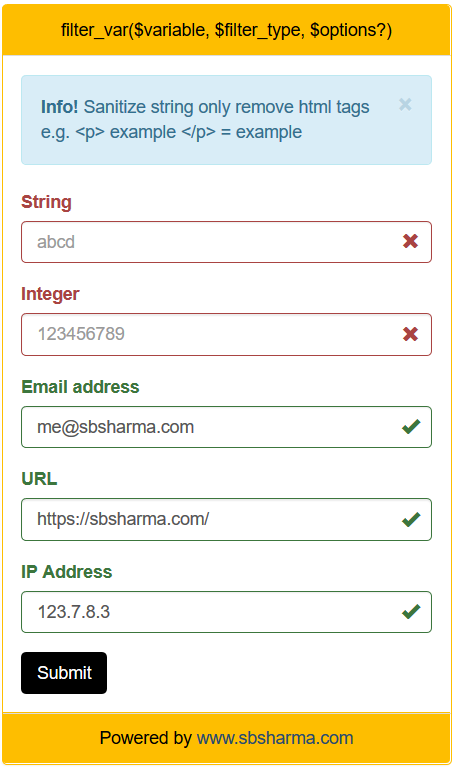

# filter-variable-with-php
This is an example of filter variable PHP function uses.
  - Error will be focused
  - Used PHP OOPs to create validator
  - Bootstrap for nice layout

## Final output screen

